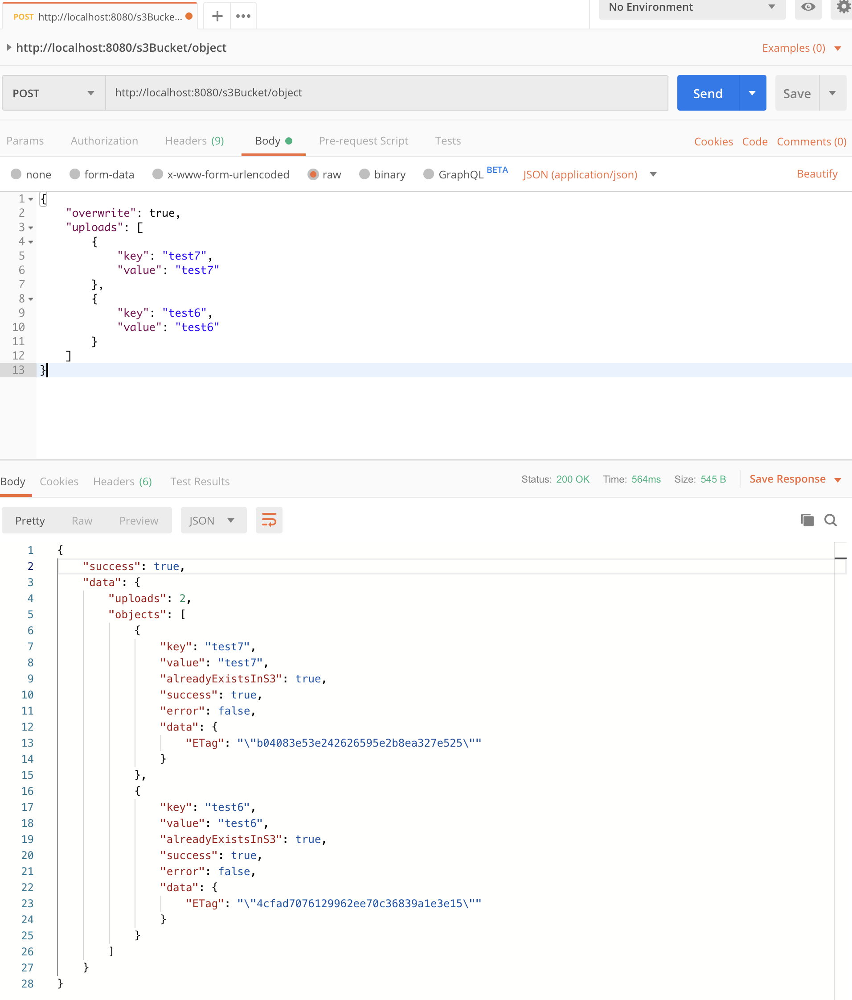

This simple node/express server is based on the question:
```
Given an S3 bucket has been provisioned for you.
Create a REST endpoint using Node/Express which accepts the following input format:
[
    {
        "key": str
        "value": str
    },
    {
        "key": str
        "value": str
    },
…
]
For each element of the list, see if there exists an object with that key in the S3 bucket. If it does not exist, create a new object with that key and "value" as its contents.
Be sure to write unit tests and use git for version control.
```

Some assumptions I decided:
* do not overwrite files by default, but allow overwrite if parameter passed in
* no need to verify aws credentials or bucket (stored in .env file)

# Initialize the node modules the first time in this directory and fill in your AWS credentials in a .env file
```
npm i
cp .env.example .env
vim .env
```

# Tests
```
npm run test
```

# Start the server
```
node server.js
```

# See image below for example of a POST body and response

